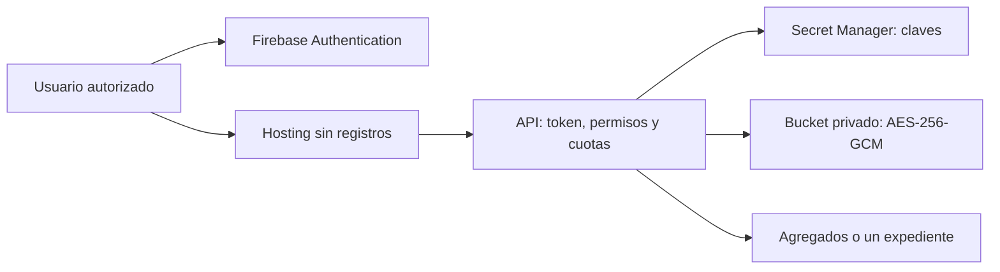

# Revisión de seguridad — STE 2.0

Fecha: 2 de octubre de 2026. Alcance: implementación local, dependencias, artefactos públicos y migración cifrada. Skills aplicadas: diagnóstico, Firebase Authentication y auditoría de reglas Firebase. La autorización posterior del usuario permitió implementar las correcciones. No se cambió infraestructura ni se enviaron mensajes.

## Qué se protege



| Control | Implementación y evidencia |
|---|---|
| Identidad | `src/auth.js`: correo/contraseña y persistencia solo en memoria. Sin registro en interfaz. |
| Autorización | `functions/security.cjs`: allowlist exacta de cuatro correos, claim administrativo `steAccess`, proveedor password, correo verificado y contraseña inicial cambiada. |
| Backend obligatorio | `functions/handler.cjs`: `verifyIdToken(token,true)` antes de leer datos; comprueba también revocación/usuario deshabilitado mediante Admin SDK. |
| Cifrado | AES-256-GCM, clave de 32 bytes aleatoria, IV de 12 bytes nuevo por escritura, tag de 16 bytes y AAD ligado a versión/key id. HTTPS para tránsito. |
| Gestión de claves | Keyring solo servidor vía Secret Manager. Copia de preparación protegida por Windows DPAPI CurrentUser; fuera de public, ZIP y Git. |
| Storage | `storage.rules`: deniega todo acceso cliente, incluso autenticado. IAM uniforme y prevención pública están descritos en la guía y pendientes de aplicar/verificar. |
| Minimización | `/api/consult`: un documento exacto, sin wildcard ni arrays; máximo 2.000 filas. `/api/dashboard`: cálculo agregado servidor. Sin listado de documentos ni descarga completa. |
| Abuso | Cuotas persistentes por UID seudonimizado y escritura condicional de generación. Fallar la cuota cierra el acceso; no se elude cambiando de instancia. |
| Integridad | Importación validada también en servidor, gzip con límite de salida, tipos y tamaños de celdas, fechas/documentos obligatorios y concurrencia optimista. |
| Browser | CSP de scripts propia, no inline handlers, no resultados en IndexedDB/localStorage, limpieza de caché heredada al abrir, `no-store` en respuestas privadas. |
| Privacidad adicional | Mapas externos automáticos y exportación CSV retirados; consulta sin documento en URL; logs de aplicación sin cuerpos, correos ni documentos. |
| Publicación | Manifiesto con hashes, lista positiva de archivos y verificación previa a Hosting. El build no lee datos privados. |

La clave pública de configuración Firebase no es la clave de cifrado ni concede permisos. Se obtuvo del endpoint público de configuración del proyecto. La autorización depende del token y del backend, no de ocultar esa configuración.

## Hallazgos y límites

| ID | Severidad | Estado / evidencia | Acción |
|---|---|---|---|
| S01 | CRÍTICO | La publicación antigua incluía toda la base. La copia auditada coincide por SHA-256 con el origen de la migración. No se ha reemplazado en esta tarea. | Publicar versión segura o mantenimiento; retirar canales/versiones antiguas y revisar copias ya expuestas. |
| S02 | ALTO | IAM, Auth, reglas y secretos de producción aún no configurados/validados con este código. | Ejecutar guía y controles posteriores; no considerar producción certificada. |
| S03 | MEDIO | Clave inicial compartida solicitada por el usuario. | Solo para incorporación: verificación del correo y cambio personal obligatorio antes de consultar. No se guarda en fuente. |
| S04 | MEDIO | Un usuario autorizado ve información individual y puede copiarla. Las cuatro cuentas consultan toda la base por instrucción del usuario. | Cuotas, auditoría y revocación; no se garantiza impedir capturas, DevTools o extracción lenta. Evaluar MFA y permisos más acotados si cambia el requisito. |
| S05 | MEDIO | Copias originales sin cifrar permanecen en el origen y pueden existir en nube/sincronización/cachés. | Custodia y depuración conforme a política del responsable; no se borraron originales. |
| S06 | MEDIO | Google Cloud/Secret Manager administradores, proceso servidor y navegador autorizado pueden acceder al claro. | Revisar IAM mínimo y dispositivos de confianza. Es cifrado de almacenamiento/transporte, no cifrado de extremo a extremo frente al servidor. |
| S07 | BAJO | Parseo Excel cliente y procesamiento de base en memoria; recursos acotados, sin prueba de carga adversarial de producción. | Límites, máximo dos instancias, concurrencia 1; observar latencia/costos reales. |

No se promete seguridad absoluta ni imposibilidad de extracción. El bloqueo de impresión y la ausencia de botones de exportación son frenos de interfaz, no límites de seguridad. Los controles reales están en servidor.

## Dependencias

Firebase cliente 12.19.0, Admin 14.5.0, Functions 7.4.0, esbuild 0.28.2 y SheetJS 0.20.3. Se fijaron las resoluciones `@grpc/grpc-js` 1.14.5 en herramientas cliente y `uuid` 11.1.1 bajo gaxios 6.7.1 en servidor para corregir avisos del escáner. El código empaquetado solo usa Firebase App/Auth; no implementa Firestore. Gaxios usa `uuid.v4`, cuya compatibilidad CommonJS se conserva con 11.1.1.

`npm audit` reportó cero vulnerabilidades conocidas en ambas instalaciones después de esas correcciones; esto no detecta todos los defectos y no certifica el sistema. Avisos oficiales: [gRPC](https://github.com/grpc/grpc-node/security/advisories/GHSA-m9gg-hp2v-232j), [uuid](https://github.com/uuidjs/uuid/security/advisories/GHSA-w5hq-g745-h8pq).

## Evaluación de reglas (formato de la skill)

```json
{
  "score": 4,
  "scale": "1-5; mayor indica más protección",
  "scope": "reglas locales de Storage y autorización de API, no producción",
  "findings": [
    {"severity":"info","description":"Storage deniega toda lectura/escritura cliente; no hay bypass por create/update ni por roles declarados por cliente."},
    {"severity":"high","description":"Admin SDK usa IAM y no está limitado por reglas. Configuración IAM y prevención pública de producción pendientes de comprobar."},
    {"severity":"info","description":"No se usan reglas Firestore; no aplica su evaluación."}
  ],
  "not_verified": ["emulador oficial de reglas", "IAM real", "Auth real", "Secret Manager real", "prueba de penetración independiente"]
}
```

La evaluación es una revisión de implementación, no un sello de cumplimiento normativo. No se alteraron reglas del subsidio, valores ni decisiones de pago.
